# FacultyAI Recruitment System

AI-enabled faculty recruitment platform for automated resume evaluation,
technical assessment, psychometric screening, and administrative
decision support.

## Dataset

Resume Dataset:
https://drive.google.com/drive/folders/1ce5eOycBV3gvPSAyXLM8hvEdEAUD2Qmn?usp=sharing

## Psychometric and Technical Questions

Psychometric Questions:
https://docs.google.com/spreadsheets/d/1awODGC7HHvRcsP8ZV2sbj5Ki363UA1i1/edit?usp=sharing

Technical Questions:
https://docs.google.com/spreadsheets/d/1G6a6SJgLDzLPdkw8Z3VzvaxDUWzOZ_9A/edit?usp=sharing

------------------------------------------------------------------------

# Project Overview

FacultyAI Recruitment System is an AI-assisted recruitment platform
developed to automate faculty candidate evaluation. The system combines
resume analysis, skill matching, technical assessment, psychometric
evaluation, and result generation.

It provides a complete workflow from candidate application to final
recommendation while reducing manual screening effort and improving
evaluation consistency.

The application is developed using React + Vite with PDF processing,
automated scoring, browser storage, and analytics support.

------------------------------------------------------------------------

# Project Features

## AI Resume Analysis

-   Extracts text from uploaded PDF resumes.
-   Identifies skills and calculates resume-fit score.
-   Highlights missing skills.

## Candidate Application Flow

-   Collects candidate information.
-   Supports PDF resume upload.
-   Creates candidate profile.

## Technical Assessment

-   Loads department-specific questions from Excel.
-   Supports timed assessment.
-   Automatically calculates scores.

## Psychometric Evaluation

-   Loads questions from CSV.
-   Evaluates behavioral and professional suitability.

## Results Generation

-   Combines resume, technical, and psychometric scores.
-   Generates final score and recommendation.
-   Creates downloadable PDF reports.

## Admin Dashboard

-   Provides candidate history and ranking.
-   Displays analytics using charts.
-   Supports candidate record management.

------------------------------------------------------------------------

# Objectives

## Primary Objective

Build an end-to-end digital recruitment workflow for faculty hiring.

## Secondary Objectives

-   Automate candidate evaluation.
-   Provide consistent scoring.
-   Generate transparent reports.

------------------------------------------------------------------------

# Technologies Used

## Frontend

-   React 18
-   Vite
-   React Router DOM
-   Tailwind CSS
-   Framer Motion
-   Radix UI

## AI/ML Technologies

-   pdfjs-dist for PDF extraction.
-   Skill matching and scoring algorithm.
-   Department-based evaluation.

## Additional Libraries

-   jsPDF
-   papaparse
-   xlsx
-   recharts
-   react-hook-form
-   lucide-react

## Database

-   Browser localStorage for candidate persistence.

------------------------------------------------------------------------

# System Architecture

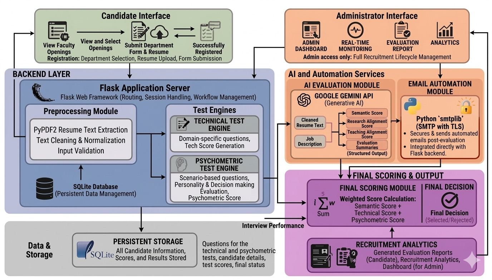

## Architecture Flow

```

[ User Browser ] 
      |
      v
[ React UI Layer ]
      |
      v
[ Routing / Pages ]
      |
      v
[ Recruitment Context ]
      |
      +--> [ Resume Analyzer ]
      +--> [ Question Loader ]
      +--> [ PDF Report Generator ]
      |
      v
[ Browser Storage (localStorage) ]
      |
      v
[ Admin Dashboard Visualization ]

```
------------------------------------------------------------------------

# Sample Video

https://drive.google.com/file/d/1Kjc71bvCJIMp842jGN7ySobfOKDh7LKv/view?usp=sharing

------------------------------------------------------------------------

# Project Workflow

1.  Candidate submits details and resume.
2.  Resume text is extracted and analyzed.
3.  Skill matching and scoring are performed.
4.  Candidate completes technical assessment.
5.  Candidate completes psychometric evaluation.
6.  Final score and recommendation are generated.
7.  Admin reviews candidate analytics.

------------------------------------------------------------------------

# Module Description

## Home Page

-   Provides project introduction and navigation.

## Apply Page

-   Collects candidate details and resume.
-   Creates candidate record.

## Resume Analysis Page

-   Displays resume score, skills, and missing skills.

## Technical Test Page

-   Runs department-specific assessments.

## Psychometric Test Page

-   Evaluates candidate behavioral profile.

## Results Page

-   Shows final evaluation and PDF report.

## Admin Login Page

-   Provides admin authentication.

## Admin Page

-   Displays candidate rankings and analytics.

------------------------------------------------------------------------

# User Roles

## Candidate

-   Applies for faculty positions.
-   Uploads resume.
-   Completes assessments.
-   Views results.

## Admin

-   Reviews candidates.
-   Views analytics.
-   Manages recruitment records.

## Recruiter / Hiring Committee

-   Uses reports for decision support.

------------------------------------------------------------------------

# Screenshots

## Home Page

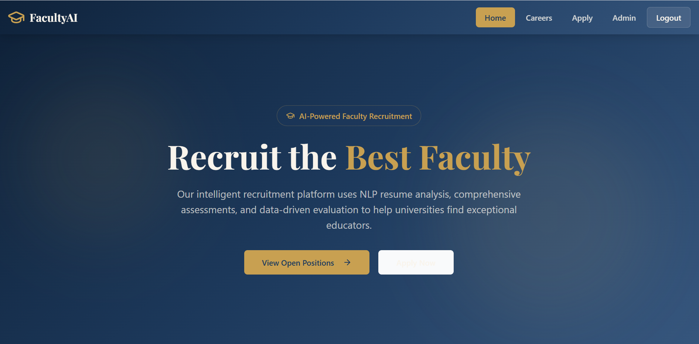

## Apply Page

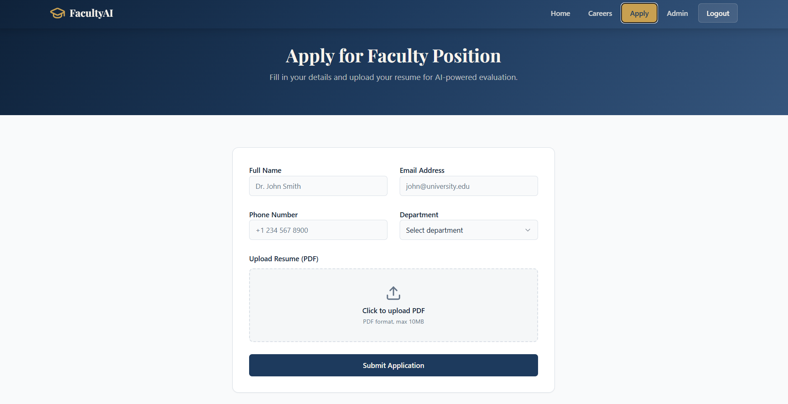

## Resume Analysis Page

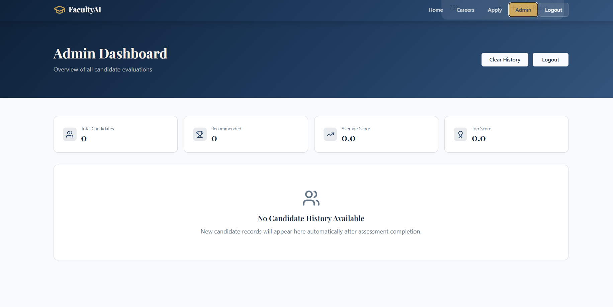

## Technical Test Page

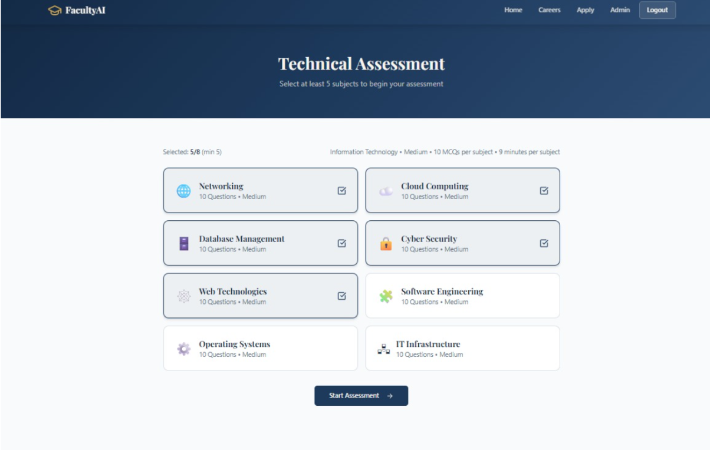

## Psychometric Test Page

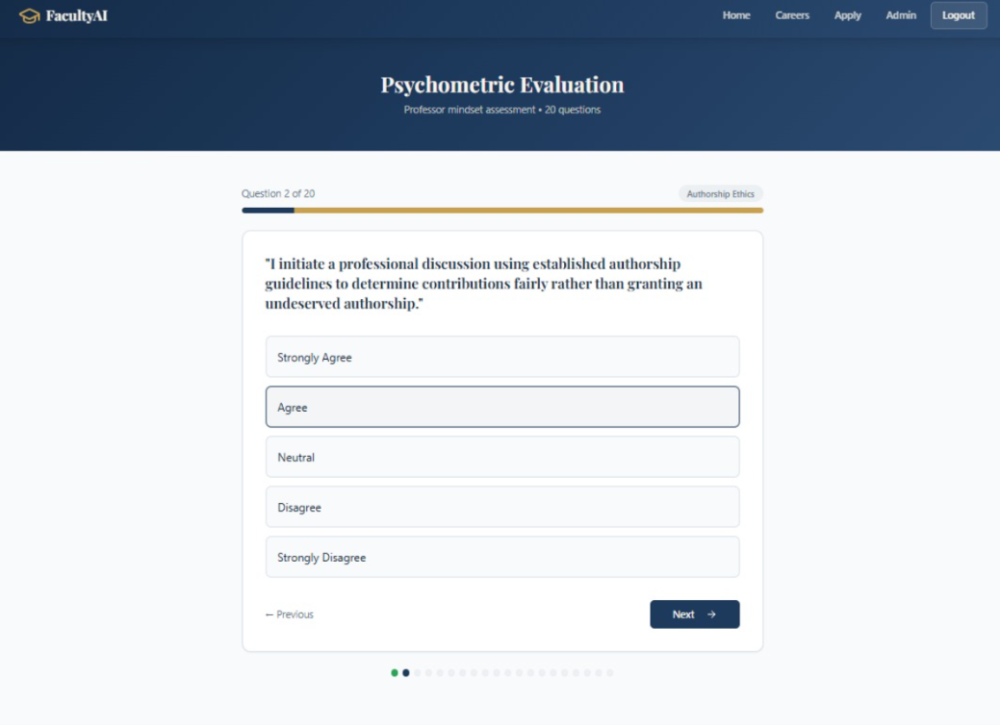

## Results Page

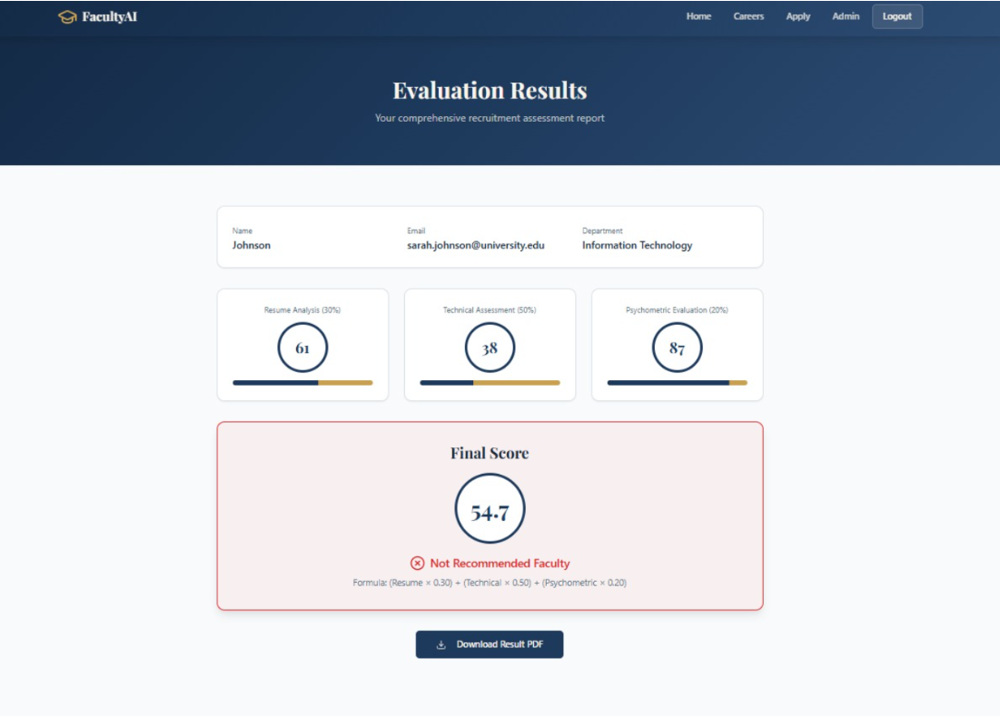

## Admin Dashboard

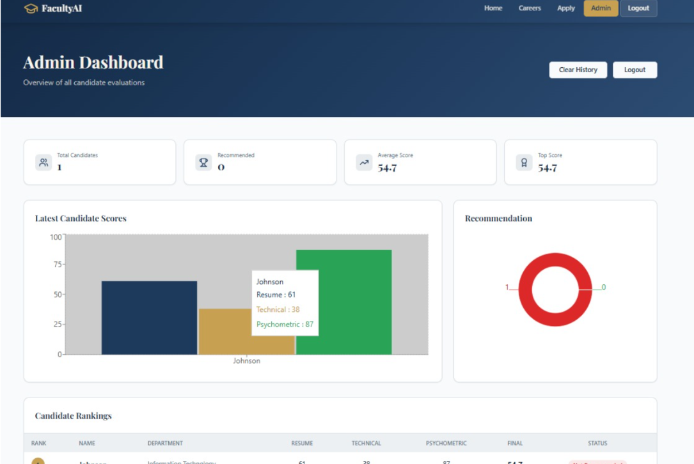

------------------------------------------------------------------------

# API Documentation

The workflow is implemented entirely in the browser using:

- Static asset fetch for `public/data/technical_questions.xlsx`
- Static asset fetch for `public/data/psychometric_questions.csv`
- Browser `localStorage` for candidate persistence

No `POST /api/*` or server-side endpoints are included in this frontend-only implementation.

------------------------------------------------------------------------

# Database Design

## Storage

Browser localStorage stores candidate records.

## Candidate Schema

-   id
-   name
-   email
-   department
-   resumeAnalysis
-   technicalScore
-   psychometricScore
-   finalScore
-   recommendation

## Relationship

    Candidate
     |
     +-- Resume Analysis
     +-- Technical Assessment
     +-- Psychometric Assessment
     +-- Final Result

------------------------------------------------------------------------

## Folder Structure

```
.
├── public
│   ├── data
│   │   ├── psychometric_questions.csv
│   │   └── technical_questions.xlsx
│   ├── _redirects
│   └── robots.txt
├── src
│   ├── App.tsx
│   ├── main.tsx
│   ├── components
│   │   ├── Navbar.tsx
│   │   ├── ProtectedRoute.tsx
│   │   └── ui
│   ├── context
│   │   ├── AuthContext.tsx
│   │   └── RecruitmentContext.tsx
│   ├── lib
│   │   ├── pdfGenerator.ts
│   │   ├── questionLoader.ts
│   │   ├── resumeAnalyzer.ts
│   │   └── utils.ts
│   ├── pages
│   │   ├── AdminLoginPage.tsx
│   │   ├── AdminPage.tsx
│   │   ├── ApplyPage.tsx
│   │   ├── CareersPage.tsx
│   │   ├── HomePage.tsx
│   │   ├── PsychometricTestPage.tsx
│   │   ├── ResumeAnalysisPage.tsx
│   │   ├── ResultsPage.tsx
│   │   ├── TechnicalTestPage.tsx
│   │   └── NotFound.tsx
│   ├── data
│   │   └── questions.ts
│   ├── hooks
│   └── styles
├── package.json
├── tsconfig.json
├── vite.config.ts
├── tailwind.config.ts
└── bun.lockb

```
------------------------------------------------------------------------

# Installation Guide

``` bash
git clone <repository-url>
cd facultyai-recruitment-system
npm install
```

Run:

``` bash
npm run dev
```

Build:

``` bash
npm run build
```

------------------------------------------------------------------------

# Usage Guide

1.  Open the application.
2.  Submit candidate details.
3.  Upload resume.
4.  Complete assessments.
5.  View final report.
6.  Admin reviews dashboard.

------------------------------------------------------------------------

# Configuration

Files: 
- vite.config.ts 
- tailwind.config.ts
- tsconfig.json
- package.json

Storage: 
- admin_session
- candidate_history

------------------------------------------------------------------------

# Testing

-   Candidate workflow testing.
-   Resume validation.
-   Assessment scoring verification.
-   PDF report testing.
-   Dashboard testing.

------------------------------------------------------------------------

# Results

The repository includes candidate evaluation reports and comparison visuals for the project.

## Candidate Shortlisting Evaluation

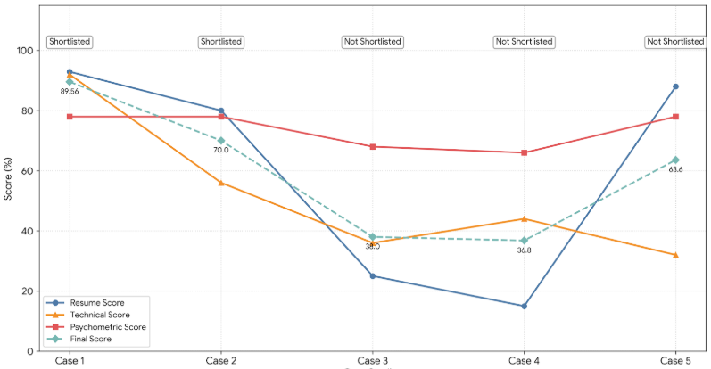


## Candidate Score Breakdown

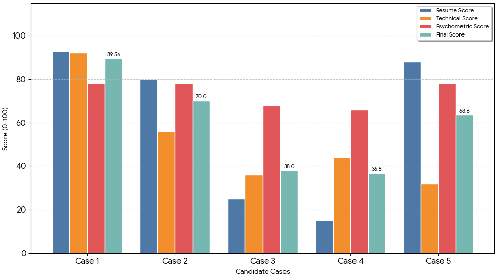

## Comparative Metrics Analysis

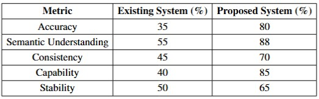

## Model Performance Comparison

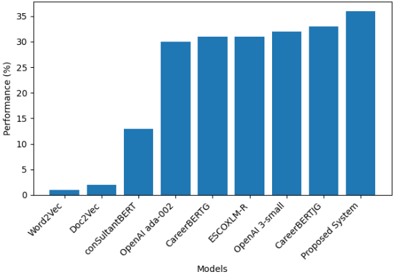


------------------------------------------------------------------------

# Security Features

-   Protected admin route.
-   Authentication handling.
-   Input validation.
-   Local resume processing.

------------------------------------------------------------------------

# Future Enhancements

1.  Backend database integration.
2.  Secure authentication.
3.  Real AI semantic resume matching.
4.  Email notifications.
5.  Interview scheduling.
6.  Advanced analytics.

------------------------------------------------------------------------

# Challenges Faced

-   Resume extraction accuracy.
-   Managing assessment data.
-   Maintaining workflow state.
-   Building analytics dashboard.

------------------------------------------------------------------------

# Learning Outcomes

-   React development.
-   Resume processing.
-   Context API state management.
-   Data visualization.
-   Frontend persistence.

------------------------------------------------------------------------

# Deployment

Supported platforms: 
- Vercel
- Netlify
- GitHub Pages
- Cloudflare Pages

------------------------------------------------------------------------


## System Requirements

### Hardware
- Processor: Dual-core CPU
- RAM: 4 GB minimum
- Storage: 200 MB free disk space

### Software
- Operating System: Windows, macOS, Linux
- Node.js: v18+ recommended
- Browser: Latest Chrome, Edge, Firefox, Safari
- No database server required for frontend-only mode


------------------------------------------------------------------------

